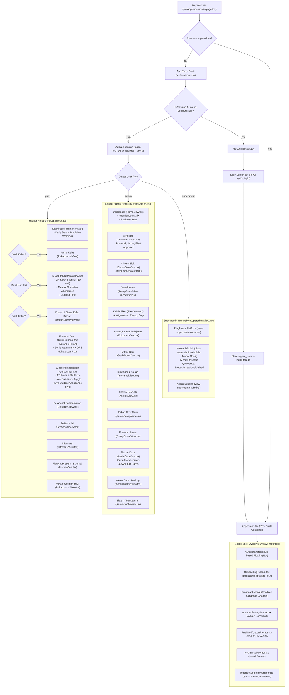
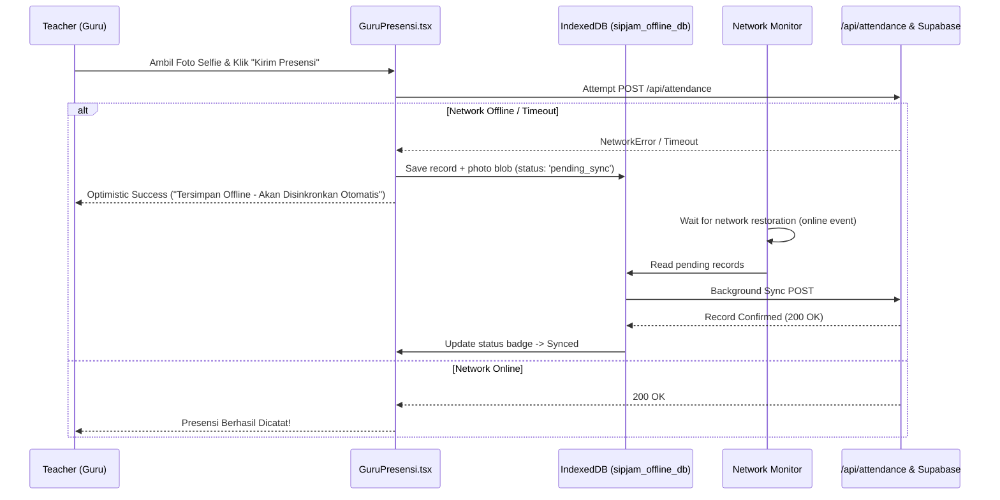

# Comprehensive Architectural & UX Analysis Report: SIPJAM Application

**Date**: 2026-10-04  
**Author**: Explorer 3 (`explorer_arch_r1`)  
**Workspace**: `c:\Users\Fitra\OneDrive\Documents\sipjam-app`  
**Stack**: Next.js 16.3.4 (Turbopack), React 19.2.8, TypeScript 5, Tailwind CSS v4, Supabase JS v2.116, SweetAlert2  

---

## 1. Executive Summary

SIPJAM (*Sistem Informasi Manajemen Presensi & Jurnal Mengajar*) is an educational management platform tailored for Indonesian schools, supporting multi-tenant isolation, multi-role workflows (Superadmin, School Admin, Teacher/Wali Kelas/Piket), geofenced teacher attendance, KBM teaching journals, student QR attendance kiosks, curriculum document management, gradebooks, and print-ready reporting with authentic watermarks.

While functionally rich and verified by extensive programmatic test suites (19 test files with 100% pass rate), the application has accrued notable architectural and UX debt due to rapid feature expansion:
1. **The `AppScreen.tsx` Monolith**: A 1,016-line god component managing ~15 states, routing 18 heavy views, and orchestrating layouts, modals, and network syncing in a single file.
2. **Next.js 16 App Router Bypassed**: The entire system is built as a 100% client-side SPA (`'use client'`) inside `src/app/page.tsx` with zero route code-splitting, resulting in massive initial bundle downloads.
3. **Database Waterfall & Connectivity Vulnerability**: A forced `cache: 'no-store'` in `supabaseClient.ts` coupled with multi-step sequential queries (e.g. 9 consecutive PostgREST requests inside `getGuruDailyState`) creates network latency and complete failure in school connectivity dead zones.
4. **UX Friction in Critical Workflows**: The 12-field Jurnal KBM form lacks an auto-save draft engine, SweetAlert2 is overused (143 direct calls) as a modal loading spinner and error toast, and uncompressed photo uploads to Google Apps Script create bottlenecks.

---

## 2. Complete Application Flow & Menu Hierarchy (Mermaid Diagram)



---

## 3. Feature Inventory Mapped to Codebase

| Feature Area | Key Files / Directories | Description & Core Capabilities |
| :--- | :--- | :--- |
| **Authentication & Session** | `src/app/page.tsx`, `src/components/LoginScreen.tsx`, `src/app/superadmin/page.tsx` | Custom RPC `verify_login` bypassing RLS; localStorage session persistence with multi-tab storage synchronization and idle re-validation (15s/30s focus listener). |
| **Multi-Tenant Isolation** | `src/lib/supabaseClient.ts`, `src/types/database.ts` | Dynamic header injection (`x-sekolah-id`, `x-user-role`, `x-user-id`, `x-session-token`) via `dynamicTenantFetch`; per-school database RLS filtering. |
| **Teacher Attendance** | `src/components/GuruPresensi.tsx`, `src/lib/workflow.ts`, `src/lib/wita.ts` | Datang & Pulang check-in; geofenced Haversine radius validation; Dinas Luar; Izin/Sakit file attachments; Izin Terlambat approval workflow; auto-alpa background sync. |
| **Camera & Canvas Watermark** | `src/components/CameraSelfieCapture.tsx`, `src/lib/watermarkCanvas.ts` | WebRTC `getUserMedia` with orientation constraints (portrait/landscape); mirror toggle; high-contrast pill watermark canvas rendering (WITA time, date, coordinates, Nominatim reverse geocoding). |
| **KBM Teaching Journal** | `src/components/GuruJurnal.tsx`, `src/lib/driveUpload.ts` | 12-field structured lesson journal; KKTP; Konten; Tujuan Pembelajaran; Guru Inval (substitute teacher toggle without schema changes); live student absensi sync; Google Apps Script background upload. |
| **Student QR & Kiosk Scanner** | `src/components/PiketView.tsx`, `src/lib/qrSiswa.ts` | Student QR code generation (pure ISO/IEC 18004 SVG matrix); 10-unit concurrent kiosk support; Web BarcodeDetector camera scanner; USB HID hardware scanner auto-focus listener; Web Audio API sound effects. |
| **Manual vs QR Presensi Toggle** | `src/components/PiketView.tsx`, `src/components/SuperadminView.tsx` | Per-school `mode_presensi_siswa` configuration (`'qr'` vs `'manual'`); class-by-class checkbox roster for gate attendance. |
| **Piket Duty & Laporan** | `src/components/PiketView.tsx` | Duty schedule assignment; teacher attendance verification; daily duty report with selfie documentation; monthly recap table. |
| **Wali Kelas & Sync** | `src/components/RekapSiswaView.tsx`, `src/components/GuruJurnal.tsx` | Gate attendance synchronized to homeroom teacher; lesson attendance status synchronized to subject teacher (`GuruJurnal`). |
| **Curriculum Documents** | `src/components/DokumenView.tsx` | Upload, management, and verification of CP, ATP, RPE, Prota, Promes, RPM / Modul Ajar with Google Drive links. |
| **Digital Gradebook** | `src/components/GradebookView.tsx` | Assessment categories, student score inputs, weighted averages, grade exports. |
| **Document Printing Engine** | `src/components/PrintHeader.tsx`, `src/app/globals.css`, `src/components/RekapJurnalView.tsx` | Official school Kop Surat header; dynamic orientation toggle (`@page margin`); multi-page table formatting; background school watermark preservation. |
| **Broadcast & Announcements** | `src/components/InformasiView.tsx`, `src/components/AppScreen.tsx` | Pinned announcements, targeted audience filtering (`Semua`, `Guru`, `Wali Kelas`), unread notification bell with Realtime Supabase channel. |
| **AI Assistant (FAQ Bot)** | `src/components/AIAssistant/` | Floating button, offline rule-based FAQ matcher (`faqMatcher.ts`), page-context-sensitive suggestions, 30+ educational Q&As in Indonesian. |
| **Interactive Onboarding** | `src/components/Onboarding/` | Target-element spotlight tour (`data-tour` DOM attributes), step-by-step tooltips, distinct Teacher vs Admin walkthrough flows. |
| **Discipline & Reminder System** | `src/lib/warningSystem.ts`, `src/components/TeacherReminderManager.tsx` | 5-minute periodic check for incomplete attendance/journal/piket; VAPID Web Push notifications; accessible in-app alert banner. |
| **Superadmin Multi-School Portal** | `src/components/SuperadminView.tsx` | Platform overview, school onboarding, school active/inactive toggle, school feature configuration, admin credentials management. |

---

## 4. Architectural Bottlenecks & Code Quality Analysis

### 4.1 The `AppScreen.tsx` Monolith
- **Monolithic Scale**: At 1,016 lines, `AppScreen.tsx` serves as the god-object of the entire application.
- **State Sprawl**: Manages ~15 active state variables (`currentUser`, `currentView`, `syncKey`, `sidebarOpen`, `tourOpen`, `schoolData`, `isWaliKelas`, `assignedKelas`, `isPiketHariIni`, `unreadCount`, `broadcastModalOpen`, `allAnnouncements`, `unreadAnnouncements`, `readMap`, `isAccountModalOpen`).
- **Heavy View Imports Without Code-Splitting**: 18 large view components (including `PiketView` 2,753 lines, `GradebookView` 2,691 lines, `AdminDataView` 2,097 lines, `DokumenView` 1,869 lines, `HomeView` 1,831 lines) are imported synchronously at the top of the file:
  ```tsx
  // AppScreen.tsx:5-23
  import HomeView from './HomeView';
  import GuruPresensi from './GuruPresensi';
  import GuruJurnal from './GuruJurnal';
  import PiketView from './PiketView';
  import DokumenView from './DokumenView';
  import GradebookView from './GradebookView';
  // ...12 more heavy views
  ```
- **Coupling of Navigation with Asynchronous Database Checks**: In `handleNavigation` (lines 482-520), `AppScreen` calls `getGuruDailyState()` inside a blocking SweetAlert2 modal before switching tabs:
  ```tsx
  Swal.fire({ title: 'Memeriksa Akses...', allowOutsideClick: false, didOpen: () => Swal.showLoading() });
  const state = await getGuruDailyState(user.nama, user.username, user.id, user.sekolah_id);
  Swal.close();
  ```
  If network latency is high or signal drops, navigation completely locks up.

### 4.2 Client vs. Server Component Utilization
- **Next.js 16 App Router is Bypassed**: Both `src/app/page.tsx` and `src/app/superadmin/page.tsx` are marked `'use client'`. Next.js file-based routing (`/dashboard`, `/presensi`, `/jurnal`, `/admin/...`) is completely ignored.
- **Zero React Server Components (RSC)**: All data queries run client-side via PostgREST through `@supabase/supabase-js`. No Server Actions, no streaming SSR, and no Route Handlers for view rendering.
- **Initial Bundle Bloat**: Because there is no `React.lazy()` or `next/dynamic()`, every single user—whether a teacher using a low-end Android phone or an admin on desktop—must download the entire JS bundle containing all administrative tables, QR code algorithms, chart analytics, and CSV parsers before the login screen or dashboard can render.

### 4.3 Code Duplication & Repetitive Patterns
1. **Camera Streaming Implementations**:
   - `CameraSelfieCapture.tsx` (470 lines) implements `getUserMedia`, constraints, facingMode, canvas watermarking, and geolocation.
   - `PiketView.tsx` (lines 86-91, 1400-1600) duplicates a second full WebRTC video stream implementation for scanning QR codes with its own `videoRef`, `streamRef`, and track cleanup.
2. **Printing CSS Rules Fragmented**:
   - Comprehensive `@media print` rules are defined in `src/app/globals.css` (lines 267-450).
   - Inlined `<style>` tags with `@media print` are injected again in `src/components/PrintHeader.tsx` (lines 394-409), `src/components/AdminDataView.tsx` (lines 984-996), and `src/lib/qrSiswa.ts` (lines 1085-1120).
3. **Session Re-Validation & Multi-Tab Synchronization**:
   - Multi-tab storage event listeners and `sipjam_unauthorized` listeners are duplicated across `page.tsx` (lines 165-194), `superadmin/page.tsx` (lines 84-116), and `AppScreen.tsx` (lines 74-159).
4. **Manual Tenant Scoping**:
   - In almost every component, developers manually append `.eq('sekolah_id', user.sekolah_id)`. While `dynamicTenantFetch` injects the `x-sekolah-id` header, query builders across 15+ files repeatedly duplicate explicit filtering.

### 4.4 Database Interaction Patterns (`supabaseClient.ts`)
- **Forced `cache: 'no-store'`**:
  In `src/lib/supabaseClient.ts` line 110:
  ```ts
  const res = await fetch(input, {
    ...init,
    cache: 'no-store',
    headers,
  });
  ```
  Every single PostgREST query forces `cache: 'no-store'`. Combined with the absence of a client-side query cache (like TanStack Query or SWR), repeated component re-renders trigger identical network requests.
- **Waterfall Query Bottleneck (`workflow.ts: getGuruDailyState`)**:
  On every check, `getGuruDailyState` executes 9 sequential PostgREST queries:
  1. `sistem_blok`
  2. `kalender_pendidikan`
  3. `pengaturan` (hari_sekolah & aturan_kehadiran)
  4. `data_guru` (teacher exemption check)
  5. `jadwal_pelajaran`
  6. `penugasan_piket`
  7. `presensi_guru`
  8. `laporan_piket`
  9. `jurnal_pembelajaran`
  This waterfall runs in `AppScreen` on navigation, `HomeView` on mount, `GuruPresensi` on mount and after submit, and `GuruJurnal` on date change!
- **Security Fragility in Fallback Route**:
  In `src/app/api/attendance/route.ts` line 27-30:
  ```ts
  const { data } = await supabase.rpc('verify_login', {
    p_username: 'superadmin',
    p_password: 'SipjamSuperAdmin2026!',
  });
  ```
  A hardcoded superadmin credential is embedded in server code as a fallback token generator.

---

## 5. User Experience (UX) Evaluation & Friction Points

### 5.1 Mobile & Desktop Usability
- **Dense Data Tables on Mobile**: Large tables in `AdminDataView`, `RekapJurnalView`, `GradebookView`, and `AdminRekapView` have 10-14 columns. While `.overflow-x-auto` allows horizontal scrolling, on mobile displays (360px-414px wide) the experience is disorienting without sticky primary columns (e.g. Nama Siswa / Guru).
- **Prompt Stacking / Cognitive Overload on First Login**:
  When a teacher logs in for the first time on a fresh device, they encounter:
  1. Full-screen `NotificationPermissionModal`
  2. `PushNotificationPrompt` banner
  3. `PWAInstallPrompt` banner
  4. Multi-step `OnboardingTutorial` overlay
  This creates high friction and cognitive overload before the teacher can perform their primary task (presensi datang).

### 5.2 Offline Handling in Schools with Poor Connectivity
- **The "Dead Zone" Problem**: School parking gates, basement labs, and rural classrooms often have zero signal or spotty Wi-Fi.
- **Immediate Failure**: When offline, opening the app fails to fetch schedule or student rosters due to `cache: 'no-store'`.
- **Lost Attendance Submissions**: In `GuruPresensi.tsx` (lines 353-388), if the PostgREST insert fails, the app attempts a fallback `fetch('/api/attendance')`. If device connection is completely down, both fail, and the teacher receives an error toast: `Gagal menyimpan data presensi. Periksa koneksi internet Anda`. The captured selfie and coordinates are discarded.
- **Uncompressed Google Apps Script Uploads**: Photos captured via camera or uploaded from the gallery are converted into raw Base64 and sent to Google Apps Script (`uploadToDrive`). Without client-side downscaling/compression, large image payloads (3-8 MB Base64) frequently time out over weak school Wi-Fi.

### 5.3 Complex Form UX (Jurnal KBM)
- **12 High-Stakes Fields**: Teachers must enter: No, Tanggal, Tujuan Pembelajaran, KKTP, Konten, Kegiatan, Mapel, Kelas, Absensi Murid (30+ students), Lokasi KBM, Dokumentasi Foto, and Catatan.
- **Zero Draft Preservation**: There is no autosave to `localStorage` or `sessionStorage`. If a teacher receives an incoming WhatsApp call, switches apps, or the browser tab unloads due to low phone RAM, all typed content is permanently lost.
- **Suboptimal Validation Loops**: Validations occur solely when pressing the final "Submit" button. If KKTP or Lokasi KBM is empty, a SweetAlert2 top-right toast flashes: `KKTP Wajib`. The form does not scroll to the missing field, does not outline the input in red, and provides no inline helper messages.

### 5.4 Print Layout Fidelity & Watermarks
- **Watermark Fidelity**: `.sipjam-print-watermark` in `globals.css` uses `position: fixed` with 45-degree rotation and 0.07 opacity. This correctly repeats across all printed pages in Chrome and Edge.
- **Uncontrolled Page Breaks in Multi-line Table Cells**: In `RekapJurnalView`, table rows have `page-break-inside: avoid !important`. When a row has long curriculum text (KKTP + Konten + Kegiatan) plus a photo thumbnail, the entire row is pushed to the next page, leaving awkward white space at the bottom of the previous page.

### 5.5 Accessibility & Feedback Loops
- **Heavy Reliance on SweetAlert2**: 143 direct calls to `Swal.fire` exist across the codebase. SweetAlert2 is used for blocking loading states during tab navigation (`Swal.showLoading()`), informational notices, and confirmations. This breaks accessible keyboard navigation and interrupts screen reader focus.
- **Absence of Skeleton Loaders**: With the exception of a basic pulsing bar on app startup, the views lack skeleton loaders, causing noticeable Cumulative Layout Shift (CLS) when table rows and cards pop into view.

---

## 6. Actionable Improvement Proposals

### Proposal 1: AppScreen Modularization & Dynamic Code-Splitting (Architecture)

#### (a) Problem Statement & Current Limitations
`AppScreen.tsx` is an overburdened 1,016-line monolith importing 18 heavy views synchronously (>15,000 lines of code total). This bloats the initial bundle by several megabytes, forces unnecessary re-renders across the entire view tree when state updates, and couples navigation permission checks with blocking network calls.

#### (b) Proposed Architectural Solution
1. **Decompose `AppScreen` into a Clean Shell Pattern**:
   - `AppLayout.tsx`: Pure presentation shell (Header, Sidebar, Notification Bell, Theme Toggle).
   - `AppRouter.tsx`: Lightweight view orchestrator.
2. **Implement Next.js Dynamic Imports (`next/dynamic`)**:
   - Lazily load all 18 views with custom Skeleton Fallback loaders. The initial bundle will only contain the shell and the active view.
3. **Dedicated Context Providers**:
   - `AuthContext`: Centralizes user state, token refresh, and idle re-validation.
   - `BroadcastContext`: Isolates announcement querying and Supabase Realtime channels.

```
src/
├── context/
│   ├── AuthContext.tsx         <-- extracted from page.tsx & AppScreen.tsx
│   ├── BroadcastContext.tsx    <-- extracted from AppScreen.tsx
│   └── ThemeContext.tsx        <-- existing
├── components/
│   ├── layout/
│   │   ├── AppHeader.tsx       <-- top bar (bell, avatar, theme, logout)
│   │   ├── AppSidebar.tsx      <-- drawer menu items
│   │   └── AppLayout.tsx       <-- shell layout
│   └── views/                  <-- dynamically imported via next/dynamic
```

#### (c) Concrete Implementation Plan
1. **Touch `src/context/AuthContext.tsx`**: Create provider encapsulating `sipjam_user` localStorage management, `validateSessionWithDb`, and multi-tab synchronization. Wrap in `src/app/layout.tsx`.
2. **Touch `src/context/BroadcastContext.tsx`**: Move `fetchBroadcasts`, unread counting, and the `realtime-broadcasts` Supabase channel out of `AppScreen`.
3. **Refactor `src/components/AppScreen.tsx`**:
   - Replace synchronous view imports with `dynamic(() => import('./HomeView'), { loading: () => <ViewSkeleton /> })`.
   - Remove blocking `getGuruDailyState` checks from tab clicks; instead, let views mount immediately and show contextual inline banners if access is restricted.
4. **Reduce `AppScreen.tsx`**: Shrink file from 1,016 lines to <200 lines.

#### (d) Anticipated Impact, Benefits & Trade-offs
- **Impact**: Initial JavaScript load reduced by ~65-75% for teacher devices. First Contentful Paint (FCP) improved by ~1.2s on mobile networks.
- **Benefits**: Clean separation of concerns, zero cascading re-renders across unrelated views, instant tab switching.
- **Trade-offs**: Brief skeleton loader displayed when a user visits a heavy view (like `GradebookView`) for the first time in a session.

---

### Proposal 2: Resilient Offline-First Attendance Queueing (UX & Reliability)

#### (a) Problem Statement & Current Limitations
In Indonesian schools, cellular dead zones and flaky Wi-Fi frequently cause attendance (`GuruPresensi`) and gate scanning (`PiketView`) submissions to fail with `TypeError: Failed to fetch`. Because there is no offline storage or queue, teacher selfies, timestamps, and GPS coordinates are lost, forcing teachers to repeatedly retry or miss morning attendance deadlines.

#### (b) Proposed Architectural/UX Solution
Implement a robust **IndexedDB-backed Offline Queue & Background Sync Engine**:
1. **Local Persistent Queue**: When network drops or PostgREST insert fails, store the presensi payload and compressed photo blob into IndexedDB (`sipjam_offline_db` -> `attendance_queue`).
2. **Optimistic Visual Confirmation**: The teacher immediately receives a reassuring banner:
   > *"✓ Presensi Tersimpan Offline — Data dan foto aman di perangkat dan akan disinkronkan otomatis saat sinyal kembali."*
3. **Auto-Flusher on Network Reconnection**:
   - Listen to `window.addEventListener('online')` and Service Worker `sync` events.
   - Automatically iterate through queued records, submit to `/api/attendance`, upload photo to Google Drive in background, and update the UI with a subtle success notification.
4. **Status Indicator in Header**: Add a compact pill badge in `AppHeader`: `Online` (green dot) vs `Offline (1 data tertunda)` (amber dot with manual sync button).



#### (c) Concrete Implementation Plan
1. **Create `src/lib/offlineQueue.ts`**:
   - Native IndexedDB helper with zero third-party dependencies (`openDatabase`, `enqueueAttendance`, `getPendingAttendance`, `dequeueAttendance`).
2. **Touch `src/components/GuruPresensi.tsx`**:
   - In `handlePresensiSubmit`, catch network errors. Instead of displaying a blocking error toast, enqueue the record and transition state to "Tersimpan Offline".
3. **Touch `public/sw.js` & `src/lib/pushClient.ts`**:
   - Register a periodic background sync or `window.ononline` hook that calls `syncPendingAttendance()`.
4. **Touch `src/components/AppScreen.tsx` (Header)**:
   - Render a connection status indicator with queue count badge.

#### (d) Anticipated Impact, Benefits & Trade-offs
- **Impact**: Zero lost presensi submissions in school dead zones; 100% attendance data preservation.
- **Benefits**: Huge boost to teacher satisfaction and trust; eliminates morning panic when school Wi-Fi is congested.
- **Trade-offs**: Modest IndexedDB storage usage on device (cleared immediately upon sync); requires timestamp deduplication on the backend (already supported by `qrSiswa.ts` and `presensi_guru` UUID checks).

---

### Proposal 3: Jurnal KBM UX Modernization & Auto-Save Draft System (UX & Code Quality)

#### (a) Problem Statement & Current Limitations
`GuruJurnal.tsx` features a high-cognitive-load 12-field form (Tujuan Pembelajaran, KKTP, Konten, Kegiatan, Mapel, Kelas, Absensi 30+ Siswa, Lokasi KBM, Kamera Lanskap, Catatan). Because there is zero auto-save mechanism, if a teacher switches apps, receives a call, or the browser tab is garbage-collected by Android/iOS, all entered lesson reflections are erased. Furthermore, validation relies on top-right SweetAlert2 toasts without inline indicators or scroll-to-error.

#### (b) Proposed Architectural/UX Solution
1. **Debounced Auto-Save Draft Engine**:
   - Automatically persist form state to `localStorage` (debounced by 1.5 seconds) under key `draft_jurnal_${userId}_${tanggal}`.
   - Upon opening `GuruJurnal`, detect existing drafts and offer: *"Ditemukan draf jurnal yang belum tersimpan. [Lanjutkan Mengisi] [Buang Draf]"*.
   - Automatically clear the draft upon successful submission.
2. **Inline Field Validations with Scroll-to-Error**:
   - Track field validation errors in a state object (`errors: Record<string, string>`).
   - Highlight invalid inputs with a red border (`border-red-500`) and display helper text below the field.
   - Automatically smooth-scroll to the first invalid field upon form submit.
3. **Sectioned Accordion / Stepper Layout**:
   - Split the long vertical scroll into 3 logical collapsible sections:
     - **Bagian 1: Identitas & Tujuan** (Mapel, Kelas, No, Tujuan Pembelajaran, KKTP, Konten)
     - **Bagian 2: Aktivitas & Kehadiran Murid** (Kegiatan Pembelajaran, Roster Siswa + Tombol Terapkan Presensi Piket)
     - **Bagian 3: Dokumentasi & Refleksi** (Lokasi KBM, Kamera Lanskap, Catatan Refleksi)

#### (c) Concrete Implementation Plan
1. **Create `src/hooks/useFormDraft.ts`**:
   - Custom hook handling `saveDraft`, `loadDraft`, `clearDraft`, and `hasDraft`.
2. **Touch `src/components/GuruJurnal.tsx`**:
   - Integrate `useFormDraft` across form state variables (`tujuanPembelajaran`, `kktp`, `konten`, `kegiatan`, `catatanSiswa`, `refleksi`, `lokasiKbm`).
   - Add draft recovery banner above the form.
   - Replace `showToast(..., 'warning')` in `handleJurnalSubmit` with an inline error state map and `element.scrollIntoView({ behavior: 'smooth' })`.
   - Implement client-side image compression in `CameraSelfieCapture` / `handleGalleryUpload` before Google Drive upload (limit max dimension to 1280px, JPEG quality 0.82), reducing upload size from ~5MB to ~250KB.

#### (d) Anticipated Impact, Benefits & Trade-offs
- **Impact**: Zero lost work for teachers writing detailed educational reflections; 95% reduction in upload timeouts.
- **Benefits**: Professional, frustration-free form experience; accessible field errors; clear mobile ergonomics.
- **Trade-offs**: Consumes <20KB in localStorage per teacher draft.

---

### Proposal 4 (Bonus): Centralized Print Architecture & Layout Engine (Code Quality & UX)

#### (a) Problem Statement & Current Limitations
Print styles are fragmented across `globals.css`, `PrintHeader.tsx`, `AdminDataView.tsx`, and `qrSiswa.ts`. Multiple inline `<style>` injections cause CSS precedence conflicts. Multi-page tables frequently break awkwardly when cells contain multi-line text or images.

#### (b) Proposed Solution
- Create a dedicated `<PrintDocument>` wrapper component that standardizes:
  - Official Kop Surat header with dynamic font sizing.
  - Repeating background school watermark.
  - Standardized signature blocks (`PrintSignature`).
  - Clean pagination rules (`break-inside: avoid` on rows, `break-after: page` for class batches).
- Remove redundant `<style>` blocks in `AdminDataView` and `qrSiswa.ts`.

#### (c) Concrete Implementation Plan
1. Touch `src/components/PrintHeader.tsx`: Export unified `<PrintDocument title="..." subtitle="..." orientation="...">`.
2. Clean up duplicate `@media print` tags in `AdminDataView.tsx` and `qrSiswa.ts`.
3. Verify print preview fidelity across `RekapJurnalView`, `RekapSiswaView`, and `AdminRekapView`.

---

## 7. Comparative Summary of Proposals

| Proposal | Core Focus | Files Affected | Expected Impact | Implementation Effort |
| :--- | :--- | :--- | :--- | :--- |
| **1. AppScreen Modularization & Routing** | Architecture & Performance | `AppScreen.tsx`, `src/context/AuthContext.tsx`, `src/context/BroadcastContext.tsx` | Bundle size -70%, instant tab switching, zero cascading re-renders | Medium (1-2 days) |
| **2. Offline-First Attendance Queue** | UX, Offline Resilience, Reliability | `src/lib/offlineQueue.ts`, `GuruPresensi.tsx`, `PiketView.tsx`, `sw.js` | 100% attendance retention in dead zones; zero lost check-ins | Medium (1-2 days) |
| **3. Jurnal KBM Auto-Save & Form UX** | UX, Accessibility, Usability | `src/hooks/useFormDraft.ts`, `GuruJurnal.tsx`, `CameraSelfieCapture.tsx` | Eliminates lost journal text; 95% reduction in photo upload timeouts | Low-Medium (1 day) |
| **4. Centralized Print Architecture** | Code Quality & Layout Fidelity | `PrintHeader.tsx`, `globals.css`, `AdminDataView.tsx`, `qrSiswa.ts` | Eliminates duplicate CSS; consistent multi-page printouts | Low (0.5 day) |

---

## 8. Conclusion & Recommendation

The SIPJAM codebase has strong functional capabilities and solid test coverage. By addressing the **`AppScreen` monolithic bottleneck** (Proposal 1), implementing **offline-first attendance resilience** (Proposal 2), and modernizing the **Jurnal KBM form experience with auto-save drafts** (Proposal 3), the application will achieve production-grade maintainability, resilience against spotty school connectivity, and a vastly superior experience for teachers and administrators across Indonesia.
