# Laporan Pemetaan Alur Aplikasi, Routing, dan Hierarki Menu SIPJAM

**Explorer**: Explorer 1 (`explorer_nav_r1`)  
**Target Aplikasi**: `sipjam-app` (Next.js 16.3.4, React 19, Supabase, Tailwind CSS)  
**Waktu Analisis**: 2026-10-04  
**Status**: Investigasi Selesai (Read-Only)

---

## 1. Ringkasan Eksekutif & Arsitektur Routing

Aplikasi **SIPJAM (Sistem Informasi Manajemen Presensi & Jurnal Mengajar)** dibangun di atas **Next.js 16 App Router** dengan perpaduan arsitektur:
1. **Next.js Route Level**:
   - `/` (`src/app/page.tsx`): Halaman pintu masuk utama SPA (Single Page Application). Mengatur transisi *PreLoginSplash* -> *LoginScreen* -> *AppScreen*.
   - `/superadmin` (`src/app/superadmin/page.tsx`): Halaman khusus portal Superadmin dengan verifikasi sesi langsung ke database live (`users.role === 'superadmin'`). Jika bukan superadmin, otomatis di-redirect ke `/`.
   - `/api/...`: REST API Route Handlers untuk tugas latar belakang (`/api/attendance/auto-alpa`, `/api/push/send-reminders`, `/api/push/subscribe`, `/api/geocode`, dll.).
2. **Client-Side SPA View Level (`AppScreen.tsx`)**:
   - Mayoritas navigasi antar menu dilakukan melalui satu orkestrator sentral: `src/components/AppScreen.tsx`.
   - URL disinkronkan menggunakan parameter query `?view=<view-id>` melalui `window.history.pushState` dan didukung navigasi tombol back/forward browser via event listener `popstate`.
   - Komponen view di-mount secara kondisional berdasarkan state `currentView`.
3. **Session & Security Model**:
   - Sesi pengguna disimpan di `localStorage` dengan key `sipjam_user`.
   - Menggunakan RPC PostgreSQL `verify_login` berpredikat `SECURITY DEFINER` untuk memvalidasi username dan kata sandi tanpa terhalang RLS multi-tenant.
   - Sesi memiliki `session_token` yang selalu divalidasi ulang ke database Supabase secara real-time saat pengguna kembali aktif setelah jeda waktu idle (>= 15 detik pada `page.tsx`, >= 30 detik pada `AppScreen.tsx`), mencegah celah data basi (*stale cache*) dan mencabut akses seketika jika peran diubah atau sekolah dinonaktifkan.

---

## 2. Alur Autentikasi & Gerbang Keamanan Berbasis Peran (RBAC)

### 2.1 Alur Autentikasi Pengguna
```
[User Membuka Aplikasi]
        │
        ▼
[Check Sesi Lokal ('sipjam_user')] ── Ada Sesi Valid? ──► [Validasi Session Token ke DB ('users')]
        │                                                          │
   Belum Ada                                                 Token Valid?
        │                                                  ┌───────┴───────┐
        ▼                                                  ▼               ▼
[PreLoginSplash (1.8s)]                                  [YA]            [TIDAK]
        │                                                  │          (Token basi/batal)
        ▼                                                  │               │
  [LoginScreen]                                            │               ▼
        │ (Submit Form)                                    │         [Hapus Cache]
        ▼                                                  │               │
[RPC: verify_login]                                        │               ▼
  - Cek username & password                                │         [LoginScreen]
  - Cek status sekolah ('aktif')                           │
        │                                                  │
        ├─ Sekolah Nonaktif? ──► [Alert: Akses Diblokir]   │
        ├─ Kredensial Salah? ──► [Alert: Login Gagal]      │
        ▼ (Berhasil)                                       │
[Simpan 'sipjam_user' ke localStorage]                     │
        │                                                  │
        └──────────────────────────┬───────────────────────┘
                                   ▼
                             [AppScreen]
```

### 2.2 Gerbang Keamanan Navigasi (Navigation Guards)
Pada fungsi `handleNavigation(targetId)` di `AppScreen.tsx`:
1. **Superadmin & Admin**:
   - Melewati (*bypass*) seluruh pengecekan workflow harian guru. Memiliki izin membuka modul manapun yang tersedia di menunya.
2. **Guru Reguler**:
   - **Gerbang Hari Libur**: Jika hari ini berstatus Libur (tabel `kalender_pendidikan` atau libur mingguan Minggu / Sabtu 5 hari kerja), modul KBM, presensi, dan piket dikunci dengan pesan penolakan.
   - **Gerbang Presensi Datang**: Untuk membuka `view-guru-jurnal` atau `view-piket`, guru wajib telah melakukan Presensi Datang hari ini (dan tidak berstatus Izin/Sakit).
   - **Gerbang Laporan Piket**: Guru yang terjadwal piket wajib menyelesaikan Laporan Piket terlebih dahulu sebelum dapat membuka Jurnal KBM (`canOpenJurnal`).
   - **Gerbang Presensi Pulang**: Tombol presensi pulang hanya terbuka jika seluruh jurnal mengajar jadwal hari itu dan laporan piket telah lengkap (`canPresensiPulang`).
   - **Gerbang Eksklusif Wali Kelas**: `view-jurnal-kelas` dan `view-rekap-siswa` diblokir (baik di level handler maupun fallback rendering) jika akun yang login bukan Admin dan bukan Wali Kelas.
   - **Gerbang Eksklusif Petugas Piket**: `view-piket` diblokir jika guru tidak memiliki jadwal piket pada hari berjalan (`isPiketHariIni === false`).
   - **Gerbang Sistem Blok**: `view-sistem-blok` diblokir mutlak untuk Guru reguler (hanya Admin/Superadmin).

---

## 3. Hierarki Menu Lengkap per Peran

### 3.1 Peran: Superadmin (Multi-Tenant Platform Master)
Superadmin bertanggung jawab atas manajemen lintas sekolah, aktivasi lisensi sekolah, dan penyediaan akun admin sekolah.

| No | ID View / Tab | Label Menu | Ikon | File Komponen Utama | Deskripsi Fitur |
|---|---|---|---|---|---|
| 1 | `view-superadmin-overview` | Ringkasan Platform | `fa-gauge-high` | `SuperadminView.tsx` | Kartu metrik platform: Total sekolah (aktif/nonaktif), total admin, total guru, total siswa se-sistem. |
| 2 | `view-superadmin-sekolah` | Kelola Sekolah | `fa-school` | `SuperadminView.tsx` | CRUD profil sekolah (NPSN, nama, alamat, status aktif/nonaktif), pengaturan mode presensi siswa (`qr` vs `manual`), mode kamera jurnal (`camera_only` vs `camera_upload`). |
| 3 | `view-superadmin-admins` | Admin Sekolah | `fa-user-shield` | `SuperadminView.tsx` | Manajemen akun admin per sekolah, pembuatan akun admin baru, reset password, dan asosiasi `sekolah_id`. |
| 4 | Header: Pengaturan Akun | Profil & Sandi | `fa-user-gear` | `AccountSettingsModal.tsx` | Ganti avatar profil, ubah kata sandi, dan uji coba push notifikasi. |

---

### 3.2 Peran: Administrator Sekolah
Admin sekolah mengelola operasional internal sekolah, verifikasi harian, konfigurasi jam kerja, master data, serta cetak laporan akhir.

| No | ID View | Label Menu | Ikon | File Komponen Utama | Deskripsi Fitur |
|---|---|---|---|---|---|
| 1 | `view-home` | Dashboard | `fa-house` | `HomeView.tsx` | KPI harian sekolah (total guru, presensi datang, jurnal terisi, piket selesai, pulang), dan **Matriks Status Harian Guru Real-time** (filter search & tugas lengkap). |
| 2 | `view-admin-verif` | Verifikasi | `fa-clipboard-check` | `AdminVerifView.tsx` | Tab persetujuan (*Approve/Reject*): Presensi (Izin, Sakit, Terlambat, Di luar radius GPS), Jurnal KBM/Kegiatan, dan Laporan Piket. Disertai alasan penolakan. |
| 3 | `view-sistem-blok` | Sistem Blok | `fa-layer-group` | `SistemBlokView.tsx` | Manajemen periode blok khusus (Ujian, PTS, jeda semester). Menentukan rentang tanggal di mana jadwal KBM reguler dialihkan ke Jurnal Kegiatan. |
| 4 | `view-jurnal-kelas` | Jurnal Kelas | `fa-chalkboard-user` | `RekapJurnalView.tsx` | Rekapitulasi seluruh aktivitas KBM per kelas yang diampu oleh seluruh guru mata pelajaran. |
| 5 | `view-piket` | Kelola Piket | `fa-shield-halved` | `PiketView.tsx` | Akses penuh modul piket: Kiosk scan QR siswa (kamera/USB HID), presensi manual per kelas, rekap piket, dan penugasan guru piket harian. |
| 6 | `view-dokumen` | Perangkat Pembelajaran | `fa-folder-open` | `DokumenView.tsx` | Matriks kelengkapan administrasi guru (CP, ATP, RPE, Prota, Promes, RPM), verifikasi dokumen, dan pengaturan syarat dokumen. |
| 7 | `view-gradebook` | Daftar Nilai | `fa-graduation-cap` | `GradebookView.tsx` | Buku nilai kurikulum: Penilaian Tujuan Pembelajaran (TP), pembobotan Formatif & Sumatif, rekap rapor semester, dan analisis statistik ketuntasan. |
| 8 | `view-informasi` | Informasi | `fa-bullhorn` | `InformasiView.tsx` | Publikasi pengumuman sekolah, fitur semat (*pin*), penargetan audiens (Semua/Guru/Wali Kelas), dan moderasi komentar tanggapan. |
| 9 | `view-analitik` | Analitik | `fa-chart-pie` | `AnalitikView.tsx` | Papan peringkat kedisiplinan guru (*leaderboard*), poin performa kehadiran & jurnal, grafik tren ketepatan waktu bulanan. |
| 10 | `view-admin-rekap` | Rekap Akhir | `fa-file-invoice` | `AdminRekapView.tsx` | Laporan komprehensif kehadiran, keterlambatan (jam/menit/detik), potongan alpa, jurnal, dan piket berformat cetak resmi ber-KOP. |
| 11 | `view-rekap-siswa` | Presensi Siswa | `fa-users-viewfinder` | `RekapSiswaView.tsx` | Log presensi gerbang siswa (datang/pulang/device) seluruh kelas, rekap absensi KBM, dan ekspor CSV. |
| 12 | `view-admin-data` | Master | `fa-database` | `AdminDataView.tsx` | Manajemen 6 tabel master: Data Siswa (Naik Kelas, Lulus, Cetak & Download Kartu QR Siswa), Data Guru, Data Mapel, Kalender Pendidikan, Jadwal KBM, dan Wali Kelas. |
| 13 | `view-admin-backup` | Akses Data / Backup | `fa-hard-drive` | `AdminBackupView.tsx` | Ekspor & arsip data tahunan ke Google Spreadsheet via Webhook GAS dan pembersihan data historis. |
| 14 | `view-admin-config` | Sistem | `fa-gears` | `AdminConfigView.tsx` | Konfigurasi parameter sekolah: Tahun ajaran, semester, jam masuk/pulang, koordinat GPS & radius geofence, KOP surat, tanda tangan Kepsek, dan aturan kehadiran (Semua Hari vs Hari Mengajar). |
| 15 | Sidebar Action | Pengaturan Akun | `fa-user-gear` | `AccountSettingsModal.tsx` | Edit username admin, ganti password, avatar profil, aktivasi push notifikasi. |
| 16 | Sidebar Action | Lihat Tutorial Lagi | `fa-graduation-cap` | `OnboardingTutorial.tsx` | Membuka panduan tutorial interaktif 6 langkah khusus admin. |

---

### 3.3 Peran: Guru Mata Pelajaran
Guru menggunakan aplikasi untuk presensi harian, pengisian jurnal mengajar, pengunggahan perangkat ajar, dan penginputan nilai siswa.

| No | ID View | Label Menu | Ikon | File Komponen Utama | Kondisi Visibilitas & Hak Akses |
|---|---|---|---|---|---|
| 1 | `view-home` | Dashboard | `fa-house` | `HomeView.tsx` | Wajib tampil untuk semua guru. Memuat ringkasan kehadiran pribadi bulan ini, pelacak alur tugas 4 tahap (*Workflow Tracker*), dan widget jadwal KBM hari ini. |
| 2 | `view-guru-presensi` | Presensi Guru | `fa-right-to-bracket` | `GuruPresensi.tsx` | Presensi selfie potret dengan watermark otomatis (nama, NIP, tanggal, jam, koordinat GPS). Pilihan jenis: Sekolah (radius geofence), Dinas Luar, Izin/Sakit (unggah surat), atau Izin Terlambat. |
| 3 | `view-guru-jurnal` | Jurnal Pembelajaran | `fa-book-journal-whills` | `GuruJurnal.tsx` | Terbuka setelah presensi datang. Form Jurnal KBM (No, DD-MM-YYYY, TP, KKTP, Konten, Mapel, Kelas, Absensi Murid live H/I/S/A, Lokasi, Kamera lanskap/Upload GPS, Catatan). Dilengkapi toggle **Guru Inval**. Saat Sistem Blok, berganti menjadi Jurnal Kegiatan. |
| 4 | `view-jurnal-kelas` | Jurnal Kelas | `fa-chalkboard-user` | `RekapJurnalView.tsx` | **KONDISIONAL**: Hanya muncul dan dapat diakses jika guru terdaftar sebagai **Wali Kelas** (terkunci pada kelas binaannya). |
| 5 | `view-piket` | Modul Piket | `fa-shield-halved` | `PiketView.tsx` | **KONDISIONAL**: Hanya muncul dan dapat diakses jika guru memiliki **jadwal piket hari ini** (`isPiketHariIni === true`). |
| 6 | `view-dokumen` | Perangkat Pembelajaran | `fa-folder-open` | `DokumenView.tsx` | Ruang unggah dan riwayat verifikasi dokumen Kurikulum Merdeka milik pribadi (CP, ATP, RPE, Prota, Promes, RPM). |
| 7 | `view-gradebook` | Daftar Nilai | `fa-graduation-cap` | `GradebookView.tsx` | Input nilai formatif dan sumatif siswa per Tujuan Pembelajaran untuk kelas dan mata pelajaran yang diampu guru. |
| 8 | `view-informasi` | Informasi | `fa-bullhorn` | `InformasiView.tsx` | Melihat siaran dan pengumuman sekolah, serta memberikan komentar/tanggapan dua arah. |
| 9 | `view-history` | Riwayat | `fa-clock-rotate-left` | `HistoryView.tsx` | Riwayat transaksi mandiri guru (log presensi datang/pulang dan log jurnal pembelajaran yang pernah diisi). |
| 10 | `view-guru-rekap-jurnal` | Rekap Jurnal | `fa-book-open` | `RekapJurnalView.tsx` | Tabel rekapitulasi 10 kolom cetak jurnal mengajar pribadi guru dengan tata letak dokumen formal siap cetak/PDF. |
| 11 | `view-rekap-siswa` | Presensi Siswa | `fa-users-viewfinder` | `RekapSiswaView.tsx` | **KONDISIONAL**: Hanya muncul dan dapat diakses jika guru terdaftar sebagai **Wali Kelas** (terkunci pada kelas binaannya). |
| 12 | Sidebar Action | Pengaturan Akun | `fa-user-gear` | `AccountSettingsModal.tsx` | Ganti avatar, ganti kata sandi, aktivasi push notifikasi (kolom username dikunci/read-only). |
| 13 | Sidebar Action | Lihat Tutorial Lagi | `fa-graduation-cap` | `OnboardingTutorial.tsx` | Membuka panduan tutorial interaktif 5 langkah khusus guru. |

---

### 3.4 Peran Dinamis: Guru Piket (Petugas Hari Ini)
Guru Piket bukanlah role login statis, melainkan status penugasan harian dinamis yang diperiksa dari tabel `penugasan_piket` dan `jadwal_piket` melalui fungsi `getGuruDailyState`.

**Kemampuan dan Alur Kerja Petugas Piket**:
1. **Pemeriksaan Jadwal Hari Ini**:
   - Jika guru terjadwal piket hari ini, menu `view-piket` otomatis muncul di sidebar dan widget dashboard guru.
   - Jika guru tidak terjadwal, akses ditolak secara mutlak dengan modal peringatan dan kartu pengaman *Akses Terblokir*.
2. **Kiosk Presensi Siswa di Gerbang Sekolah**:
   - Beroperasi sesuai konfigurasi sekolah (`mode_presensi_siswa`):
     - **Mode QR Code**: Mendukung pemindaian kamera browser (lanskap) dan hardware USB HID scanner (hingga 10 unit / kiosk bersamaan tanpa konflik). Memilih mode datang/pulang, mencatat ke `presensi_siswa`, disertai suara feedback Web Audio API (chime sukses / beep duplikat / buzzer gagal).
     - **Mode Manual**: Menampilkan daftar siswa per kelas dengan tombol/checkbox hadir datang dan pulang yang dicentang satu per satu.
3. **Penyusunan Laporan Piket Harian**:
   - Mengisi rekapitulasi ketidakhadiran siswa per kelas, catatan kejadian/tamu, dan foto dokumentasi selfie lanskap.
   - Tersimpan ke tabel `laporan_piket` dengan status awal "Menunggu" verifikasi Admin.
4. **Sinkronisasi Otomatis**:
   - Siswa yang telah dipindai piket di gerbang otomatis memunculkan indikator hadir pada form absensi di modul `GuruJurnal` milik guru mata pelajaran hari itu.

---

### 3.5 Peran Dinamis: Wali Kelas (Homeroom Teacher)
Wali Kelas adalah status fungsional bagi guru yang nama, NIP, atau User ID-nya terdaftar pada tabel `wali_kelas` atau memiliki field `wali_kelas` pada `data_guru`.

**Kemampuan dan Pembatasan Wali Kelas**:
1. **Hak Akses Eksklusif**:
   - Menu `view-jurnal-kelas` (Jurnal Kelas) dan `view-rekap-siswa` (Presensi Siswa) otomatis diinjeksikan ke sidebar guru.
2. **Penguncian Kelas Binaan Mutlak (*Strict Class Locking*)**:
   - Data presensi siswa pada `RekapSiswaView` dan rekap jurnal pada `RekapJurnalView` (mode kelas) **dikunci mutlak hanya untuk kelas binaan wali kelas tersebut**.
   - Dropdown pemilihan kelas dikunci (*disabled*) atau hanya menampilkan kelas binaannya; guru tidak dapat melihat rekap kelas lain.
3. **Rekapitulasi Ganda Presensi Siswa**:
   - **Tab Presensi Gerbang**: Memantau jam datang dan jam pulang siswa binaan yang terekam dari scanner piket / presensi gerbang.
   - **Tab Rekap KBM**: Memantau rekapitulasi kehadiran per mata pelajaran di kelasnya, serta memiliki wewenang mengoreksi/mengubah status kehadiran siswa (H/I/S/A) dengan pencatatan audit trail pada kolom `log_perubahan`.

---

## 4. Modal, Dialog, dan Widget Mengambang (Floating Widgets)

| Nama Komponen | Lokasi File | Perilaku & Interaksi |
|---|---|---|
| **AIAssistant** | `src/components/AIAssistant/AIAssistant.tsx` | Tombol mengambang (*floating button*) di sudut kanan bawah (`bottom-5 right-5 z-[45]`) berikon `fa-robot`. Panel obrolan FAQ 100% offline rule-based (>30 basis pengetahuan), memberikan saran pertanyaan otomatis berdasarkan halaman aktif (`currentView`). Disembunyikan otomatis saat cetak (`no-print`). |
| **OnboardingTutorial** | `src/components/Onboarding/OnboardingTutorial.tsx` | Spotlight overlay interaktif penunjuk elemen UI nyata menggunakan atribut `data-tour`. Muncul otomatis saat pertama kali login (`sipjam_onboarding_guru_done` / `sipjam_onboarding_admin_done` di `localStorage`). Memiliki 5 langkah untuk Guru dan 6 langkah untuk Admin. |
| **AccountSettingsModal** | `src/components/AccountSettingsModal.tsx` | Modal pengaturan akun: pemilihan avatar SVG/preset, perubahan kata sandi dengan validasi sandi lama, pendaftaran dan pengujian Web Push Notification. Kolom edit username dibatasi hanya untuk Admin. |
| **TeacherReminderManager** | `src/components/TeacherReminderManager.tsx` | Pengingat latar belakang otomatis setiap 5 menit (`300_000 ms`). Mengevaluasi 4 kewajiban: Presensi Datang, Jurnal KBM/Kegiatan, Laporan Piket, dan Presensi Pulang. Menampilkan notifikasi visual dan in-app call-to-action. |
| **Broadcast Modal / Bell** | `src/components/AppScreen.tsx` | Ikon lonceng pada header dengan animasi getar (*bell shake*) dan lencana angka merah pengumuman belum dibaca. Membuka drawer daftar pengumuman realtime dengan tombol "Tandai Semua Dibaca". |
| **NotificationPermissionModal** | `src/components/NotificationPermissionModal.tsx` | Overlay modal pemblokir pada pembukaan pertama aplikasi untuk meminta izin notifikasi browser Web Notification API demi keandalan pengingat jadwal guru. |
| **PushNotificationPrompt** | `src/components/PushNotificationPrompt.tsx` | Banner interaktif di bagian bawah layar untuk mengajak pengguna mengaktifkan push notification browser melalui Service Worker. |
| **PWAInstallPrompt** | `src/components/PWAInstallPrompt.tsx` | Komponen penangkap event `beforeinstallprompt` browser untuk menyediakan tombol instalasi aplikasi instan PWA ke layar beranda perangkat. |
| **NaikKelasModal** | `src/components/NaikKelasModal.tsx` | Modal kenaikan kelas massal di `AdminDataView`: Memindahkan siswa terpilih ke tingkat kelas berikutnya atau menetapkan status Alumni/Lulus. |

---

## 5. Diagram Alur Aplikasi Lengkap (Mermaid Flowchart)

Berikut adalah diagram alur lengkap aplikasi yang mencakup autentikasi, routing, percabangan peran, dan seluruh modul:

```mermaid
flowchart TD
    %% Entry & Authentication Flow
    Start([Pengguna Mengakses SIPJAM]) --> CheckSession{Ada Sesi Lokal Valid?}
    CheckSession -- Tidak --> Splash[PreLoginSplash 1.8 detik]
    Splash --> LoginView[LoginScreen Portal]
    LoginView --> SubmitLogin[Submit: verify_login RPC]
    SubmitLogin --> IsValidUser{Kredensial Valid & Sekolah Aktif?}
    IsValidUser -- Ditolak --> LoginView
    IsValidUser -- Berhasil --> SaveSession[Simpan Sesi ke LocalStorage]

    CheckSession -- Ya --> ValidateDB[Validasi session_token ke Supabase DB]
    ValidateDB --> IsTokenFresh{Sesi Masih Aktif di DB?}
    IsTokenFresh -- Basi/Dicabut --> ClearSession[Hapus Sesi] --> LoginView
    IsTokenFresh -- Valid --> AppRouter

    SaveSession --> AppRouter{Router Peran: user.role}

    %% Superadmin Branch
    AppRouter -->|Role: Superadmin| SuperadminPortal[Superadmin View: AppScreen / superadmin]
    subgraph SuperadminScope [Fitur Superadmin]
        SuperadminPortal --> SA_Overview[Ringkasan Platform & Metrik Multi-Sekolah]
        SuperadminPortal --> SA_Sekolah[Kelola Sekolah: CRUD, Status Aktif, Mode Presensi Siswa QR/Manual, Mode Kamera Jurnal]
        SuperadminPortal --> SA_Admins[Admin Sekolah: Pembuatan Akun & Reset Sandi Admin]
    end

    %% Admin Branch
    AppRouter -->|Role: Admin| AdminPortal[Admin Shell: AppScreen]
    subgraph AdminScope [Menu & Fitur Administrator]
        AdminPortal --> Adm_Home[Dashboard: KPI Guru & Matriks Status Harian]
        AdminPortal --> Adm_Verif[Verifikasi: Presensi, Izin Terlambat, Jurnal, Piket]
        AdminPortal --> Adm_Blok[Sistem Blok: CRUD Periode Khusus KBM Libur/Kegiatan]
        AdminPortal --> Adm_JurnalKelas[Jurnal Kelas: Rekap Pembelajaran Seluruh Guru]
        AdminPortal --> Adm_Piket[Kelola Piket: Kiosk Scanner QR/Manual, Lapor, Penugasan]
        AdminPortal --> Adm_Dokumen[Perangkat Pembelajaran: Matriks CP, ATP, RPE, Prota, Promes, RPM]
        AdminPortal --> Adm_Gradebook[Daftar Nilai: TP Formatif, Sumatif, Rapor Semester]
        AdminPortal --> Adm_Info[Informasi: Siaran Sekolah, Pin, Diskusi Dua Arah]
        AdminPortal --> Adm_Analitik[Analitik: Leaderboard, Skor Kinerja, Tren Kehadiran]
        AdminPortal --> Adm_Rekap[Rekap Akhir: Dokumen Cetak Presensi, Keterlambatan, Jurnal]
        AdminPortal --> Adm_RekapSiswa[Presensi Siswa: Gerbang Piket & Rekap KBM Semua Kelas]
        AdminPortal --> Adm_Master[Master Data: Siswa, Guru, Mapel, Kalender, Jadwal, Wali Kelas, Download Kartu QR]
        AdminPortal --> Adm_Backup[Akses Data: Sync Webhook Google Spreadsheet]
        AdminPortal --> Adm_Config[Sistem: Profil Sekolah, KOP, Geofence GPS, Jam Presensi]
    end

    %% Guru Branch
    AppRouter -->|Role: Guru| GuruPortal[Guru Shell: AppScreen]
    subgraph GuruScope [Menu & Fitur Guru Reguler]
        GuruPortal --> Guru_Home[Dashboard: Statistik Bulanan, Tracker 4 Tahap, Jadwal Hari Ini]
        GuruPortal --> Guru_Presensi[Presensi Guru: Selfie Potret, Geofence GPS, Datang, Pulang, Terlambat, Sakit/Izin]
        GuruPortal --> Guru_Jurnal[Jurnal Pembelajaran: Form KBM / Jurnal Kegiatan Blok, Inval Guru, KKTP, H/I/S/A Live Sync]
        GuruPortal --> Guru_Dokumen[Perangkat Pembelajaran: Unggah Dokumen Administrasi Mandiri]
        GuruPortal --> Guru_Gradebook[Daftar Nilai: Penilaian Siswa Mata Pelajaran Terkait]
        GuruPortal --> Guru_Info[Informasi: Pengumuman Sekolah & Tanggapan]
        GuruPortal --> Guru_History[Riwayat: Log Transaksi Presensi & Jurnal Pribadi]
        GuruPortal --> Guru_RekapJurnal[Rekap Jurnal Pribadi: 10 Kolom Format Cetak Resmi]
    end

    %% Dynamic Role Gates for Guru
    GuruPortal --> CheckPiketToday{Jadwal Piket Hari Ini?}
    CheckPiketToday -- Ya --> Guru_Piket[Modul Piket: Kiosk Scanner Siswa & Laporan Piket Lanskap]
    CheckPiketToday -- Tidak --> LockPiket[Akses Terblokir Piket]

    GuruPortal --> CheckWaliKelas{Terdaftar Wali Kelas?}
    CheckWaliKelas -- Ya --> Guru_WaliJurnal[Jurnal Kelas: Terkunci Khusus Kelas Binaan]
    CheckWaliKelas -- Ya --> Guru_WaliRekap[Presensi Siswa: Terkunci Khusus Kelas Binaan]
    CheckWaliKelas -- Tidak --> LockWali[Akses Terblokir Wali Kelas]

    %% Shared Modals & Realtime Services
    AdminPortal -.-> SharedServices[Widget & Layanan Terpusat]
    GuruPortal -.-> SharedServices
    SuperadminPortal -.-> SharedServices

    subgraph SharedScope [Layanan & Widget Mengambang]
        SharedServices --> W_AI[AIAssistant: Floating Robot 100% Offline FAQ]
        SharedServices --> W_Tour[OnboardingTutorial: Step-by-Step UI Highlight]
        SharedServices --> W_Account[AccountSettingsModal: Profil, Password, Push Notification]
        SharedServices --> W_Reminder[TeacherReminderManager: Evaluator 5 Menit 4 Tugas Guru]
        SharedServices --> W_Bell[Broadcast Drawer: Notifikasi Real-time Pengumuman]
    end
```



---

## 6. Inventaris Fitur Berdasarkan File & Direktori Kode

| Direktori / File | Ukuran / Baris | Fitur & Kapabilitas Utama | Keterkaitan Basis Data |
|---|---|---|---|
| `src/app/page.tsx` | 227 baris | Routing SPA root, penjaga status sesi, multi-tab sync, auto re-sync idle. | `localStorage['sipjam_user']`, `users` |
| `src/app/superadmin/page.tsx` | 148 baris | Route gerbang Superadmin Next.js dengan verifikasi peran ketat. | `users.role` |
| `src/components/AppScreen.tsx` | 1,016 baris | Navigation shell sentral, sidebar responsif, header, penjaga RBAC, broadcast bell. | Semua tabel melalui relasi komponen |
| `src/components/LoginScreen.tsx` | 118 baris | Form autentikasi dengan RPC `verify_login` dan deteksi status aktif sekolah. | RPC `verify_login`, `sekolah` |
| `src/components/HomeView.tsx` | 1,831 baris | Dashboard dwifungsi: Matriks status guru harian untuk Admin & Tracker tugas 4 langkah untuk Guru. | `presensi_guru`, `jurnal_pembelajaran`, `laporan_piket`, `data_guru` |
| `src/components/GuruPresensi.tsx` | 772 baris | Presensi selfie potret, validasi Haversine GPS geofence, izin/sakit, izin terlambat. | `presensi_guru`, `pengaturan` |
| `src/components/GuruJurnal.tsx` | 1,369 baris | Jurnal KBM (KKTP, Konten, Lokasi, Live Absen H/I/S/A), Jurnal Blok, Toggle Guru Inval, upload galeri GPS. | `jurnal_pembelajaran`, `absensi`, `data_siswa`, `guru_mapel` |
| `src/components/PiketView.tsx` | 2,753 baris | Modul Piket: Kiosk scan QR (Kamera + USB HID), presensi manual, audio synthesizer, form laporan piket lanskap. | `presensi_siswa`, `laporan_piket`, `penugasan_piket`, `sekolah` |
| `src/components/RekapSiswaView.tsx` | 1,375 baris | Presensi siswa: Log gerbang presensi piket, rekap absensi KBM, penguncian kelas binaan Wali Kelas. | `presensi_siswa`, `absensi`, `wali_kelas`, `data_siswa` |
| `src/components/RekapJurnalView.tsx` | 955 baris | Rekapitulasi 10 kolom jurnal pribadi guru & jurnal pembelajaran per kelas untuk Wali Kelas/Admin. | `jurnal_pembelajaran`, `wali_kelas` |
| `src/components/SuperadminView.tsx` | 1,446 baris | Portal multi-sekolah: KPI platform, konfigurasi mode presensi per sekolah, manajemen admin sekolah. | `sekolah`, `users`, `data_guru`, `data_siswa` |
| `src/components/AdminVerifView.tsx` | 965 baris | Pusat persetujuan verifikasi presensi, izin terlambat, jurnal, dan laporan piket realtime. | `presensi_guru`, `jurnal_pembelajaran`, `laporan_piket` |
| `src/components/AdminDataView.tsx` | 2,097 baris | Master data: Siswa (Naik Kelas, Lulus, Kartu QR), Guru, Mapel, Kalender, Jadwal, Wali Kelas. | `data_siswa`, `data_guru`, `data_mapel`, `jadwal_pelajaran` |
| `src/components/SistemBlokView.tsx` | 680 baris | CRUD rentang periode Sistem Blok untuk mengalihkan jadwal KBM ke Jurnal Kegiatan. | `sistem_blok` |
| `src/components/AnalitikView.tsx` | 233 baris | Leaderboard guru, perhitungan skor kinerja kedisiplinan (Hadir: 10, Piket: 10, Jurnal: 5, Dinas: 5). | `presensi_guru`, `jurnal_pembelajaran`, `laporan_piket` |
| `src/components/DokumenView.tsx` | 1,869 baris | Manajemen Bank Dokumen Kurikulum Merdeka (CP, ATP, RPE, Prota, Promes, RPM) dan matriks kelengkapan. | `bank_dokumen`, `syarat_perangkat_pembelajaran` |
| `src/components/GradebookView.tsx` | 2,691 baris | Buku nilai kurikulum: Penilaian TP, asesmen formatif/sumatif, bulk fill, rekap rapor semester. | `tujuan_pembelajaran`, `asesmen_kolom`, `nilai_siswa` |
| `src/components/AdminConfigView.tsx` | 586 baris | Konfigurasi sistem: Jam kerja sekolah, koordinat geofence GPS, KOP surat, tanda tangan Kepsek. | `pengaturan`, `data_guru` |
| `src/components/AdminBackupView.tsx` | 276 baris | Ekspor dan arsip data ke Google Spreadsheet melalui webhook Apps Script. | `riwayat_backup`, `presensi_guru`, `jurnal_pembelajaran` |
| `src/components/InformasiView.tsx` | 758 baris | Kanal pengumuman sekolah: sematan, target audiens, interaksi komentar dua arah. | `pengumuman`, `pengumuman_tanggapan`, `pengumuman_dibaca` |
| `src/components/HistoryView.tsx` | 275 baris | Riwayat mandiri presensi dan jurnal yang pernah disubmit oleh guru login. | `presensi_guru`, `jurnal_pembelajaran` |
| `src/components/AIAssistant/...` | 4 file (65 KB) | Asisten cerdas chatbot FAQ 100% offline rule-based berbasis string similarity & kata kunci view aktif. | Hardcoded Knowledge Base |
| `src/components/Onboarding/...` | 3 file (20 KB) | Tutorial sorotan interaktif 5 langkah (Guru) & 6 langkah (Admin) dengan flag localStorage. | `localStorage` |
| `src/components/TeacherReminderManager.tsx` | 391 baris | Engine pengingat 5 menit untuk 4 tugas harian guru dengan push & in-app prompt. | `pengaturan`, `presensi_guru`, `jurnal_pembelajaran` |
| `src/lib/workflow.ts` | 620 baris | Mesin penentu status harian guru (`getGuruDailyState`): libur, blok, alpa, izin, jadwal, piket, validasi. | `kalender_pendidikan`, `pengaturan`, `jadwal_pelajaran` |
| `src/lib/qrSiswa.ts` | 682 baris | Engine QR Siswa: enkripsi identitas QR, generator SVG, kartu PNG/PDF, pencatat presensi gerbang. | `presensi_siswa`, `data_siswa` |

---

## 7. Saran Peningkatan Konkret & Terukur (Actionable Improvement Suggestions)

Berdasarkan investigasi mendalam terhadap struktur kode, pola arsitektur, dan pengalaman pengguna (*User Experience*), berikut adalah 4 rekomendasi peningkatan konkret:

### 1. Arsitektur: Dekomposisi Navigasi Monolitik `AppScreen.tsx` Menjadi Next.js Layouts & Sub-routes
- **Masalah Saat Ini**: `AppScreen.tsx` berukuran sangat besar (1,016 baris) dan bertindak sebagai monolitik router manual yang memuat seluruh modul aplikasi sekaligus (`HomeView`, `AdminDataView`, `PiketView`, `GradebookView`, dll.) dalam satu bundle klien.
- **Rekomendasi Konkret**:
  - Manfaatkan kapabilitas bawaan Next.js 16 App Router dengan membuat struktur rute:
    - `src/app/(dashboard)/layout.tsx` (sebagai shell navigasi header dan sidebar)
    - `src/app/(dashboard)/presensi/page.tsx`
    - `src/app/(dashboard)/jurnal/page.tsx`
    - `src/app/(dashboard)/piket/page.tsx`
    - `src/app/(dashboard)/admin/...`
  - Terapkan `React.lazy` / `dynamic(() => import(...))` untuk komponen berukuran masif seperti `GradebookView` (120 KB) dan `PiketView` (153 KB) guna memangkas *Initial JS Bundle Size* hingga ~60% di perangkat seluler guru.

### 2. User Experience (UX): Optimasi Alur Kiosk Piket USB HID & Feedback Mode Layar Penuh
- **Masalah Saat Ini**: Pada `PiketView.tsx`, input teks tersembunyi untuk USB HID Barcode Scanner bergantung pada event `focus` otomatis. Jika operator mengklik bagian lain di layar (misal memfilter kelas), scanner USB tidak dapat langsung menginput data tanpa mengklik kembali kotak input.
- **Rekomendasi Konkret**:
  - Tambahkan event listener global `window.addEventListener('keydown')` dengan buffer berbasis waktu (*inter-keystroke timing* < 40ms khas scanner barcode hardware) sehingga scanner USB selalu tertangkap otomatis tanpa bergantung pada elemen input yang sedang fokus.
  - Sediakan tombol toggle "Mode Kiosk Layar Penuh" (*Fullscreen Kiosk Mode*) dengan tampilan kartu identitas siswa yang besar, foto siswa, dan animasi pop-up hijau/merah yang terlihat jelas dari jarak 2–3 meter di pos gerbang sekolah.

### 3. Fungsionalitas & Keandalan Data: Mekanisme Offline-First Sync untuk Presensi Siswa di Gerbang
- **Masalah Saat Ini**: Modul scan QR di gerbang sekolah melakukan query dan insert langsung ke Supabase melalui koneksi internet. Jika koneksi seluler/Wi-Fi di pos satpam gerbang terputus saat ratusan siswa berbaris masuk di pagi hari, scan akan gagal (`NetworkError`).
- **Rekomendasi Konkret**:
  - Terapkan penyimpanan antrean lokal di browser menggunakan `IndexedDB` (atau Cache API).
  - Ketika koneksi offline, hasil scan tetap dicatat di `IndexedDB` secara instan dan ditandai `synced: false`.
  - Service Worker (`sw.js`) atau event listener `window.addEventListener('online')` akan otomatis mengunggah (*background sync*) seluruh antrean scan ke tabel `presensi_siswa` begitu internet tersambung kembali.

### 4. Arsitektur State: Konsolidasi State Pengguna & Sekolah Menggunakan React Context
- **Masalah Saat Ini**: Objek `user`, `sekolah_id`, `assignedKelas`, dan `isWaliKelas` dioper melalui prop drilling berulang-ulang ke lebih dari 15 komponen view turunan.
- **Rekomendasi Konkret**:
  - Buat `AuthUserContext` / `SchoolContext` (mirip seperti `ThemeContext.tsx` yang sudah ada) untuk membungkus `AppScreen`.
  - Komponen anak seperti `GuruJurnal`, `RekapSiswaView`, dan `AdminDataView` cukup memanggil `useAuthUser()` atau `useSchoolConfig()`, mengurangi boilerplate prop dan mencegah inkonsistensi data antar komponen.
